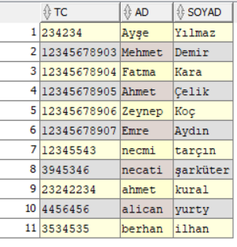
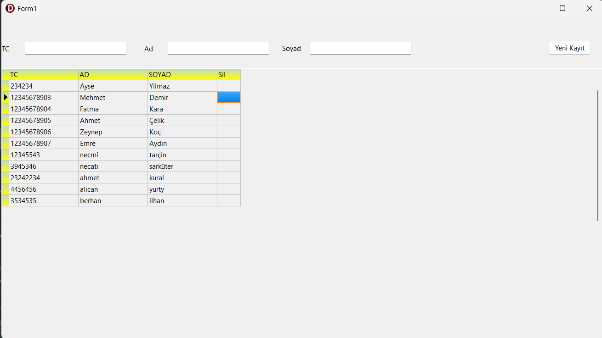
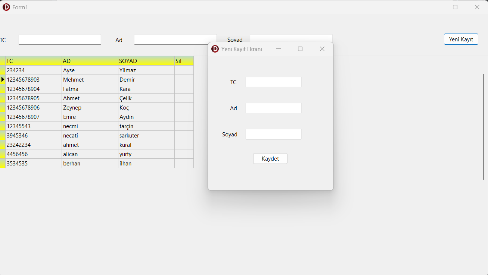
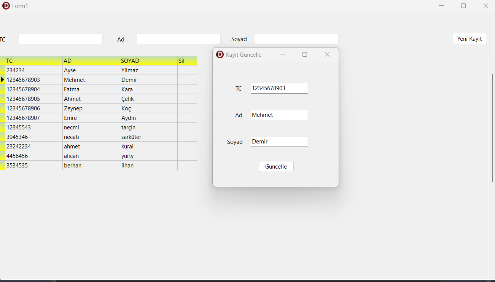
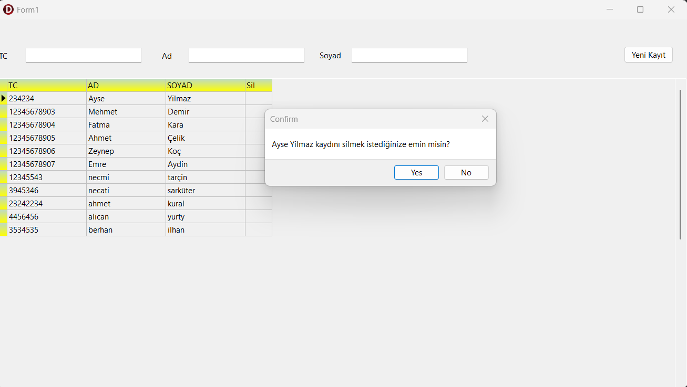

# Delphi - Oracle Bağlatı ve CRUD İşlemleri

## Veritabanı kullanıcılar tablosu
>

## DBGrid ile listeleme(Select)
> Form başlatıldığı anda veriler listelenir 
>
>

## Veritabanına veri ekleme(Insert)
> Yeni kayıt ekle adında bir form açar ve kaydet butonuna tıklandığında veriyi veritabanına ekler.
>
>

## Verileri güncelleme
>Veritabanındaki veriyi güncellemek istediğimizde DBGird'in güncellemek istediğimiz satırına çift tıklarsak güncelleme sayfasına yönlendirilip. Kutular otomatik olarak kayıt bilgileriyle doldurulacaktır. İstediğimiz kaydın ad veya soyadını değiştirdikten sonra güncelle butonu ile günceller ve güncelle formunu kapatır.
>
>

## Listeden kayıt silme
>Listeden silmek istediğimiz kaydın sil kolonuna tıkladığımızda bir uyarı mesajı çıkacaktır. Evet butonuna tıkladığımız takdirde kayıt ceritabanından silinir.
>
>

